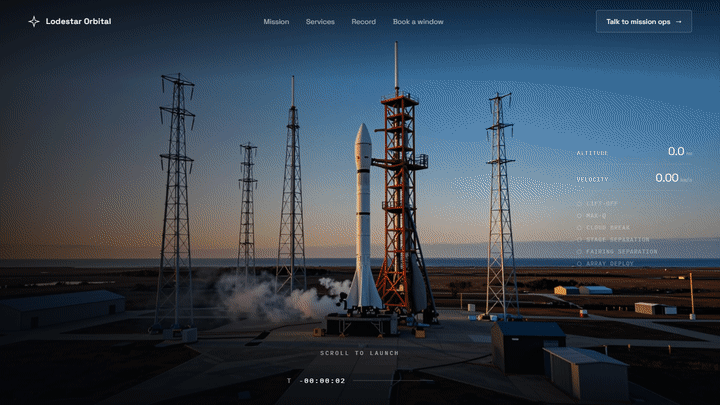
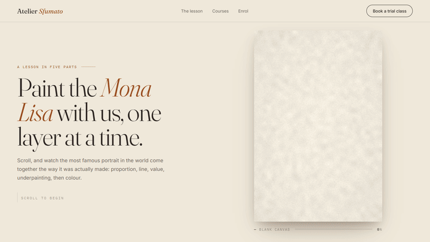
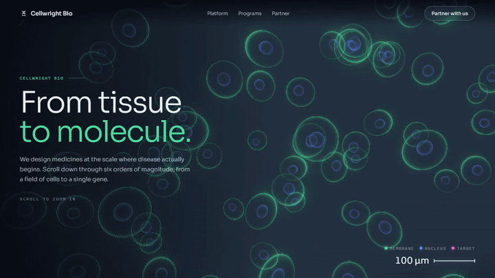

# Scroll Studio

Scroll-driven marketing sites, made three ways: AI film rendered locally, the real artwork drawn live, and live 3D.
Everything runs on a local RTX 4090. There are no API keys.

## Demos

Each demo is a scroll-through of the page, recorded with `tools/capture_demo.py`. Click a preview for the full-quality MP4.

### Lodestar Orbital: launch to orbit (AI film)
[](docs/demos/rocket.mp4)

`web/orbital.html` scrubs an 18-second film rendered locally with **LTX-2.3**: pad → lift-off → through the clouds →
stage separation → fairing opens → the satellite deploys. The camera follows a Blender blockout's depth pass, and a
locked rocket description plus timed Z-Image keyframes keep the vehicle consistent. Native 1920×1088, in six 3-second segments.
The mission HUD (T+ clock, altitude, velocity, events) is tied to scroll position.

### Atelier Sfumato: drawing the Mona Lisa (real artwork, drawn live)
[](docs/demos/mona-lisa.mp4)

`web/art.html` builds the painting in five lessons as you scroll: proportion guides → charcoal contours (face first) →
graphite value → umber underpainting → colour glazes. Every stage comes from the real painting (public domain) via
`art/build_mona.py`, so nothing drifts. WebGL composites the layers at native screen resolution, and the contours are
SVG strokes that draw themselves.

### Cellwright Bio: from tissue to molecule (live 3D)
[](docs/demos/biomedical.mp4)

`web/bio.html` zooms through six orders of magnitude with **three.js**: a field of cells → inside one cell →
chromatin in the nucleus → the DNA double helix → a small molecule docking on a highlighted target. It has a
fluorescence-microscopy look (fresnel shaders + bloom) and a live scale bar that runs from 100 µm to 0.3 nm.

Run any of them locally: `python serve.py`, then open `http://localhost:5173/orbital.html`, `/art.html` or `/bio.html`.
The film pages need their media regenerated first (`run.py ... --stage encode`, `art/build_mona.py`), because renders
and site media are kept out of git.

---

# Film pipeline (local, no API keys)

Blender blockout → detailed keyframes (Z-Image) → LTX-2.3 guided by Blender depth → scroll-scrubbed site.
Everything runs on the local RTX 4090 through ComfyUI.

```
blender/<id>.py ──► out/<id>/blockout/   beauty frames, depth frames (log depth, near = white), camera.json
                        │
                        ├─► keyframes   Z-Image Turbo + Fun ControlNet (depth) ─► keyframes/<name>.png (first, mid, last…)
                        │
                        └─► generate    LTX-2.3 22B distilled fp8
                                         + IC-LoRA Union Control fed the blurred Blender depth video (camera, layout)
                                         + timed keyframes (detail, look)                 ─► gen/<tag>.mp4
                                                                              encode ─► web/media ─► web/index.html
```

## Where detail comes from

The Higgsfield video never details its blockouts: the geometry stays low-poly, and Seedance plus
reference images supply all the detail. The same split applies here:

- **Camera and layout:** the Blender depth pass drives the Union-Control IC-LoRA. It is blurred
  (`ltx.guide_blur`) and set to 0.6 strength. At full strength with sharp edges, LTX copied the blockout
  literally and the city came out as a grid of toy boxes.
- **Detail:** Z-Image renders keyframes as photoreal stills that match the depth, and LTX passes through
  them. Use one keyframe roughly every 3–5 s; the London shot uses first (0 s), mid (6 s) and last.
  Mid keyframes use weaker control (`control_strength` 0.5, `depth_blur` 3) so the stills don't
  reproduce the boxes either.
- **Clouds and other soft things** stay out of the depth pass (`blob(..., soft=True)`). Otherwise they
  turn into solid domes.
- **Text:** the prompt describes textures and materials in time order.

## Install layout

| What | Where |
|---|---|
| ComfyUI + venv (reuses system torch cu130) | `D:\ai\ComfyUI` |
| Model files (large) | `E:\ai\models\...` (Seagate), via `D:\ai\ComfyUI\extra_model_paths.yaml` |
| Download staging (then moved to E:) | `D:\ai\hf-staging` |

Models: `ltx-2.3-22b-distilled-fp8`, `gemma_3_12B_it_fp8_scaled`, `ltx-2.3-22b-ic-lora-union-control-ref0.5`,
`ltx-2.3-spatial-upscaler-x2-1.1`, `z_image_turbo_bf16`, `qwen_3_4b_fp8_mixed`, `ae`,
`Z-Image-Turbo-Fun-Controlnet-Union-2.1-2602-8steps`.

Other desktop apps hold ~4.4 GB of VRAM, so about 19.5 GB is free for models. `--reserve-vram 1.5` keeps
ComfyUI from filling the card completely (a full card stalled a Z-Image run), and the Z-Image text encoder
runs on the CPU.

Loading from the USB drive is slow the first time (~30 GB at USB-HDD speed). After that, Windows keeps the
file in RAM (128 GB) and later runs start fast.

## Run

Start ComfyUI (leave it running):
```
set PYTHONUTF8=1
D:\ai\ComfyUI\venv\Scripts\python.exe D:\ai\ComfyUI\main.py --listen 127.0.0.1 --port 8188 --reserve-vram 1.5
```
`PYTHONUTF8=1` matters: the SeedVR2 plugin logs emoji, and without UTF-8 the Windows console encoding
crashes ComfyUI at startup. Close games before rendering, because they push VRAM past 24 GB and renders stall.

Then:
```
python run.py shots/jet_london.json --stage blockout
python run.py shots/jet_london.json --stage keyframes --variants 4     # pick the best, copy over first.png / last.png
python run.py shots/jet_london.json --stage generate --res 768x448 --seconds 3   # quick test
python run.py shots/jet_london.json --stage generate --variants 2
python run.py shots/jet_london.json --stage upscale                   # final only: SeedVR2 -> gen_4k.mp4 (3840x2160)
python run.py shots/jet_london.json --stage encode                    # 4K master -> 1440p desktop / 1280 mobile
python serve.py                                                        # http://localhost:5173
```

Iterate at 1024x576 (about 5–10 min per 10 s). Upscale only the take you keep: about 2 min per 4 s chunk,
so roughly 11 min for an 18 s film. The upscale re-encodes the finished frames into LTX's latent space,
runs the official 2x latent upsampler, and does a short refine pass. The result stays faithful to
the take and adds real edge detail (lattice towers, cloud edges). Chunks overlap by 16 frames and are
cross-faded. Finished chunks are reused on reruns (`--force` redoes them).

## Knobs (in `shots/<id>.json`)

| Key | Effect |
|---|---|
| `ltx.guide_strength` | How strictly the depth video is followed (1.0 = exact). Lower lets LTX invent more. |
| `keyframes.frames[].strength` | How closely LTX matches each still at its timestamp. |
| `keyframes.control_strength` | 0.65–1.0. How closely the stills follow the depth. |
| `ltx.res` | Base size, in multiples of 64 because the control LoRA uses a half-size reference. |
| `ltx.segments` | Split long shots; each segment continues from the previous one's last frame. |
| `upscale.sigmas` | Refine strength. Default `"0.725, 0.421875, 0.0"` (faithful). `"0.909375, 0.725, 0.421875, 0.0"` invents more detail but risks flicker between chunks. |
| `upscale.chunk` / `upscale.overlap` | Frames per chunk (8k+1, default 97) and cross-fade overlap (default 16). |

## New shot

1. Copy `shots/jet_london.json`; change `id`, prompts, captions.
2. Write `blender/<id>.py` with `blockout_lib` helpers. Check framing with `--stills 0 3 6 10`.
   The depth pass is written automatically.
3. Model real silhouettes where they matter (tower tops, wing shape). The depth pass carries shape, not colour.
4. Add a `<section class="film">` in `web/index.html` reading `window.SHOTS["<id>"]`.
