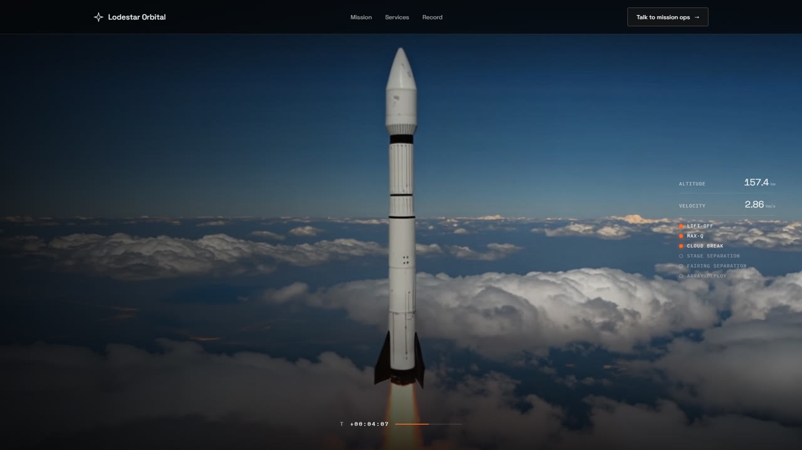
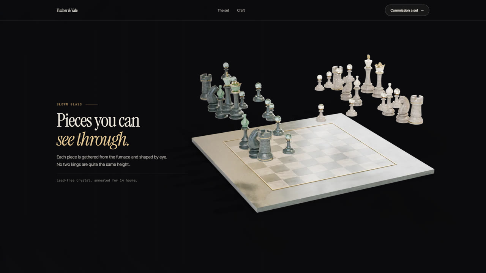
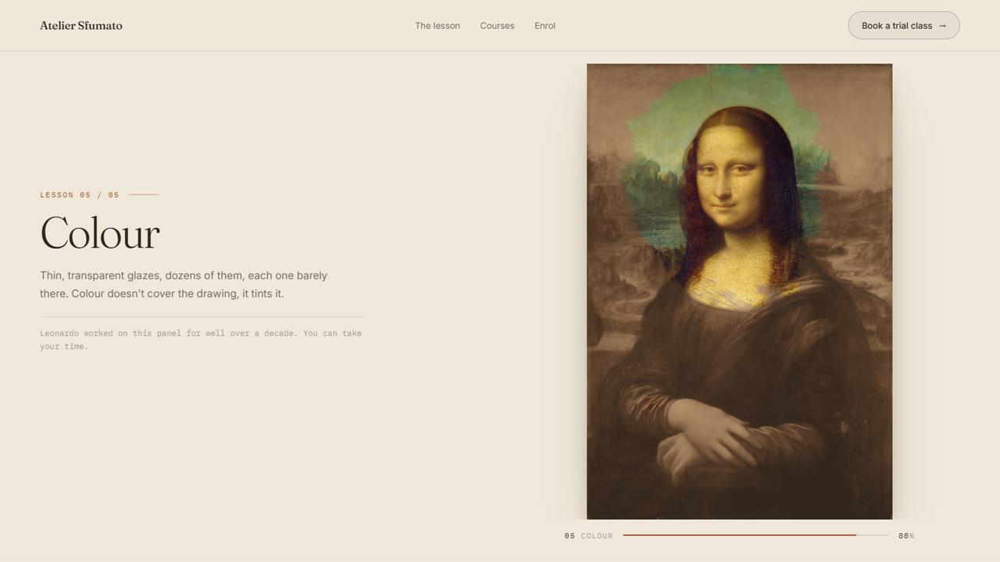
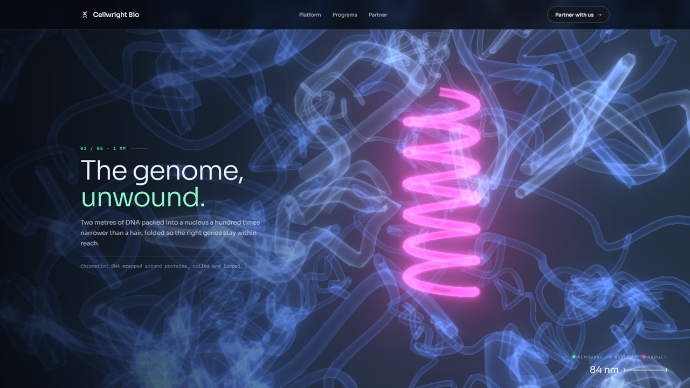
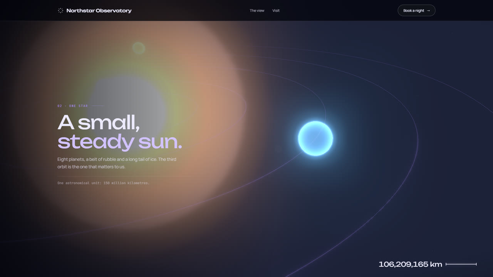
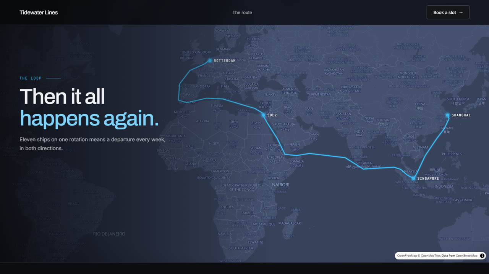
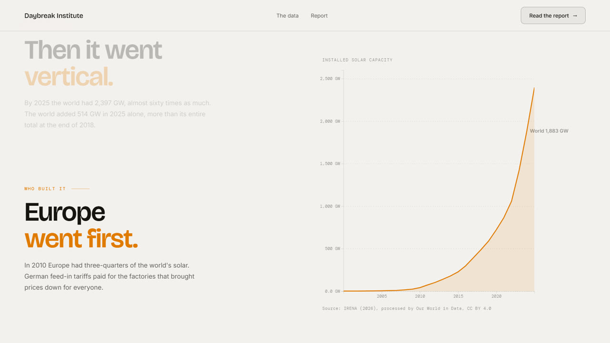
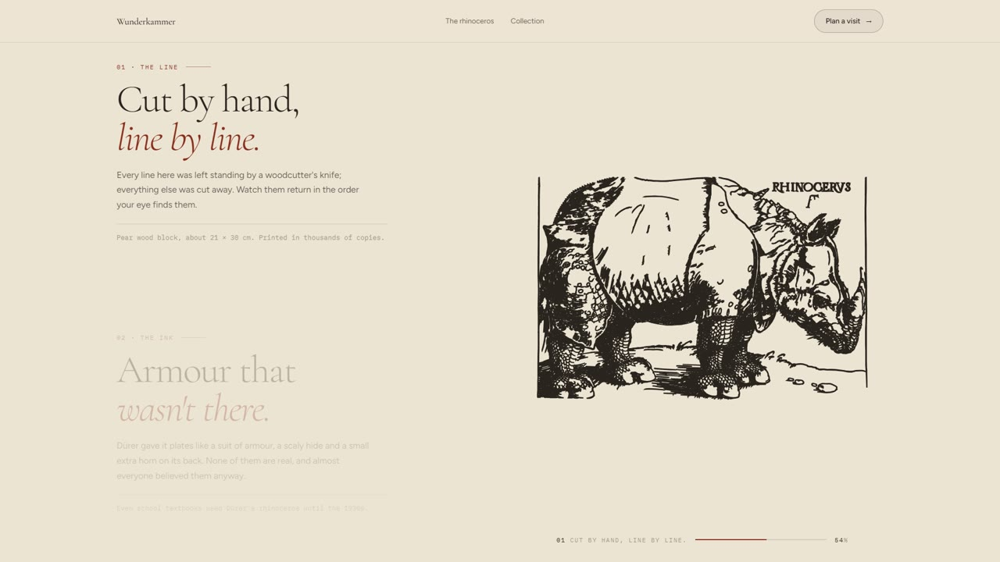
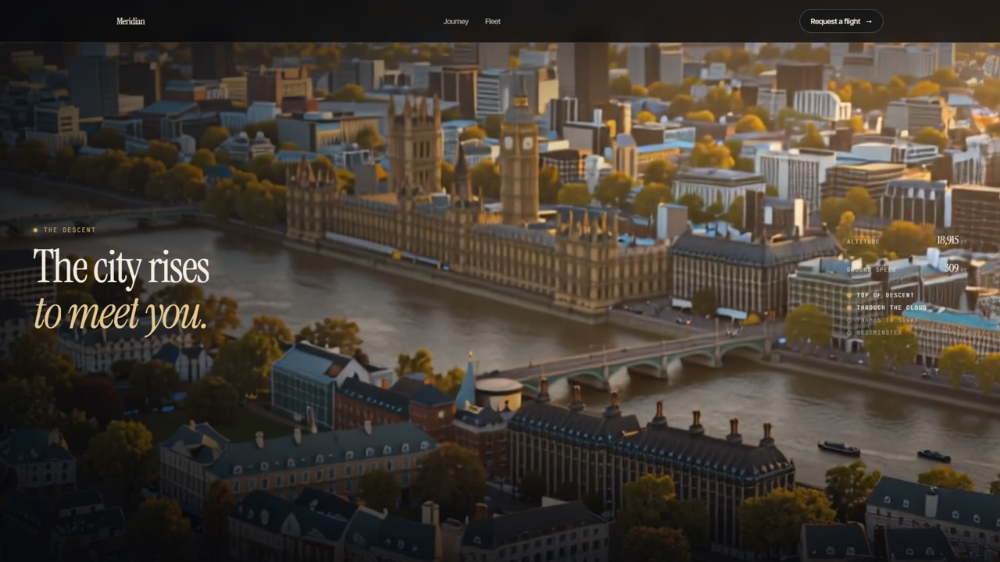
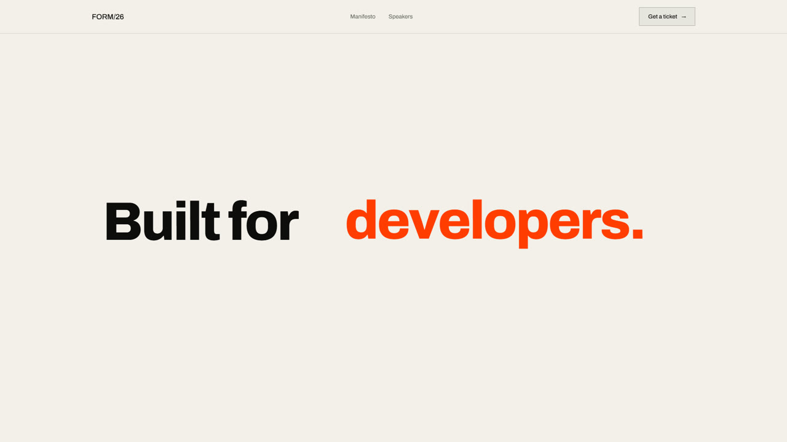

# Scroll Studio

An open-source engine for scroll-driven websites. Give it a brief, a photo, a painting, a 3D model or a film idea;
it builds a static site where scrolling plays the visuals. It runs entirely on your machine (no API keys), and
Claude can drive it end to end.

```
site.yaml ──► studio build ──► dist/  (plain static files: host anywhere)
   ▲               │
   │               ├─ film      Blender blockout → Z-Image keyframes → LTX-2.3 video → scrub-ready encode
 Studio UI         ├─ artwork   any image → guides, contour strokes, graphite, underpainting, colour layers
 Claude (MCP)      ├─ scene3d   live three.js zoom journeys built from presets or your glTF models
 CLI               ├─ sequence  Blender (Cycles) renders a 3D model: turntable, explode, reassemble
                   ├─ parallax  photos + estimated depth (Depth Anything V2) → 2.5D camera moves
                   ├─ type      kinetic typography: reveal, stack, swap, scale
                   ├─ vector    SVG or vectorised artwork drawing itself stroke by stroke
                   ├─ chart     CSV data stories with D3: series, zooms, annotations per step
                   └─ map       live vector maps (MapLibre): camera flights and routes per step
```

## Examples

<table>
<tr><td width="50%"><a href="examples/showcase/inputs/lodestar-orbital.mp4"></a><br><b>Lodestar Orbital</b></td><td width="50%"><a href="examples/showcase/inputs/fischer-vale.mp4"></a><br><b>Fischer & Vale</b></td></tr>
<tr><td width="50%"><a href="examples/showcase/inputs/atelier-sfumato.mp4"></a><br><b>Atelier Sfumato</b></td><td width="50%"><a href="examples/showcase/inputs/cellwright-bio.mp4"></a><br><b>Cellwright Bio</b></td></tr>
<tr><td width="50%"><a href="examples/showcase/inputs/northstar-observatory.mp4"></a><br><b>Northstar Observatory</b></td><td width="50%"><a href="examples/showcase/inputs/tidewater-lines.mp4"></a><br><b>Tidewater Lines</b></td></tr>
<tr><td width="50%"><a href="examples/showcase/inputs/daybreak-institute.mp4"></a><br><b>Daybreak Institute</b></td><td width="50%"><a href="examples/showcase/inputs/wunderkammer.mp4"></a><br><b>Wunderkammer</b></td></tr>
<tr><td width="50%"><a href="examples/showcase/inputs/meridian.mp4"></a><br><b>Meridian</b></td><td width="50%"><a href="examples/showcase/inputs/form-conference.mp4"></a><br><b>FORM/26</b></td></tr>
</table>

Click a preview for its scroll-through video. The [showcase site](examples/showcase/site.yaml) puts them all on one page.

Every example is a `site.yaml` in [`examples/`](examples/) and rebuilds with `studio build examples/<name>`.

| Example | Domain | Scene type | What scrolling does |
|---|---|---|---|
| [Lodestar Orbital](examples/lodestar-orbital/site.yaml) | Aerospace | `film` | A rocket launch to orbit, generated locally with LTX-2.3, with live telemetry |
| [Meridian](examples/meridian/site.yaml) | Private aviation | `film` | A jet descends through cloud over London; the altimeter counts down |
| [Atelier Sfumato](examples/atelier-sfumato/site.yaml) | Art education | `artwork` | The Mona Lisa is drawn and painted in five lessons |
| [Cellwright Bio](examples/cellwright-bio/site.yaml) | Biotech | `scene3d` | A zoom from tissue to a molecule docking on DNA |
| [Northstar Observatory](examples/northstar-observatory/site.yaml) | Astronomy | `scene3d` | A fall from the whole galaxy to one living planet |
| [Fischer & Vale](examples/fischer-vale/site.yaml) | Luxury goods | `sequence` | A glass chess set lifts off its board and settles back |
| [FORM/26](examples/form-conference/site.yaml) | Events | `type` | A conference site told in kinetic type |
| [Wunderkammer](examples/wunderkammer/site.yaml) | Museum | `vector` | Dürer's *Rhinoceros* (1515) re-cut line by line |
| [Daybreak Institute](examples/daybreak-institute/site.yaml) | Research | `chart` | Real solar data (IRENA) told as a scrolling data story |
| [Tidewater Lines](examples/tidewater-lines/site.yaml) | Logistics | `map` | Shanghai to Rotterdam, port by port, on a live map |
| [Casa Alta](examples/casa-alta/site.yaml) | Hospitality | `parallax` | Generated photos of a cliff hotel in 2.5D (needs ComfyUI to build) |
| [Hale & Rowe](examples/hale-rowe/site.yaml) | Architecture | `artwork` | A house drawn from construction lines to finished photo (needs ComfyUI) |

## Quick start

```bash
git clone https://github.com/Okohedeki/scroll-studio && cd scroll-studio
pip install -e .
studio doctor                         # what this machine can build
studio build examples/cellwright-bio  # live 3D: needs nothing but Python
studio preview cellwright-bio         # http://localhost:5173
studio ui                             # the Studio app: http://localhost:5180
```

Full setup (GPU, Blender, ComfyUI and models) is in [docs/INSTALL.md](docs/INSTALL.md).

## Make your own

```bash
studio new harbour-hotel --example atelier-sfumato   # or start blank: studio new harbour-hotel
# edit projects/harbour-hotel/site.yaml (or use studio ui), drop files in inputs/
studio build harbour-hotel --draft
studio snapshot harbour-hotel --at top --at studio:0.5   # screenshots + contact sheet
studio build harbour-hotel && studio record harbour-hotel   # final build + an MP4 scroll-through
```

A spec is a theme, a nav and a list of sections. Scenes are the scroll-driven visuals; blocks (`intro`,
`features`, `stats`, `timeline`, `quote`, `cta`, `gallery`) are the content between them:

```yaml
name: Harbour Hotel
theme: { preset: dusk }                  # night, brass, paper, lab, cosmos, studio, dusk, ink, blueprint
sections:
  - id: rooms
    type: parallax
    steps:
      - { intro: true, title: "A room above <em>the water.</em>" }
      - { title: Morning, image: { generate: "Hotel terrace above a harbour at sunrise, photoreal" } }
      - { title: Evening, image: inputs/terrace-dusk.jpg }
  - type: cta
    title: Stay <em>a while.</em>
    button: { label: Book, href: "https://example.com" }
```

`studio schema` prints every field. Inputs can be project files or https URLs; images can be generated locally
from a prompt (`generate:`). Builds are cached per stage, so editing copy never re-renders a film.

## With Claude

Open the repo in Claude Code and ask for a site. The `scroll-studio` MCP server (`.mcp.json`) gives Claude tools
to create projects, edit specs, build, take snapshots and look at them, and record videos; the `scroll-site` skill
gives it the workflow. Any MCP client can use `python -m engine.mcp_server`.

## How it's built

- `engine/`: Python. Spec (`spec.py`), scene builders (`scenes/`), compiler and themes (`compile/`), backends for
  ComfyUI, Blender and depth (`backends/`), CLI, server, MCP server, snapshot and record tools.
- `runtime/`: TypeScript. The scroll core (Lenis, sticky stages, step cards, HUDs) plus one lazily loaded player per
  scene type. Built into `engine/compile/static/runtime` and copied into every site.
- `ui/`: React. The Studio app.
- Every model, with its size and licence, is listed in [`engine/models.yaml`](engine/models.yaml).

## Licence

MIT. Model weights keep their own licences (see `engine/models.yaml`); some are non-commercial.
