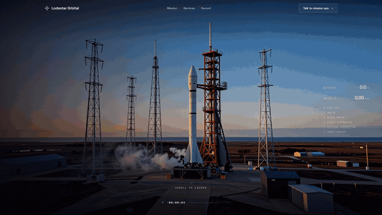

# Scroll Studio

**Scroll-driven websites from one YAML file. Runs on your own machine with no API keys, and Claude can drive it
through MCP.**

[](https://okohedeki.github.io/scroll-studio-showcase/)

**[See all twelve example sites live →](https://okohedeki.github.io/scroll-studio-showcase/)**

Give it a brief, a photo, a painting, a 3D model, a CSV or a film idea. It builds a static site where scrolling
plays the visuals: generated video, a painting drawn stroke by stroke, a live 3D zoom, a data story, a map flight.
The output is plain HTML, CSS and JS you can host anywhere.

**What you need:** 6 of the 9 scene types (`scene3d`, `chart`, `map`, `type`, `vector`, and `artwork` from your own
images) need no GPU at all, just Python and a browser. `parallax` and `sequence` run on the CPU but are much
faster on a GPU. `film` generates video locally with LTX-2.3 and needs Blender, ComfyUI and a 24 GB card (RTX
4090 class). Details in [docs/INSTALL.md](docs/INSTALL.md).

```
site.yaml ──► studio build ──► dist/  (plain static files: host anywhere)
   ▲               │
   │               ├─ film      Blender blockout → Z-Image keyframes → LTX-2.3 video → scrub-ready encode
 Studio UI         ├─ artwork   any image → guides, contour strokes, graphite, underpainting, colour layers
 Claude (MCP)      ├─ scene3d   live three.js zoom journeys built from presets or your glTF models
 CLI               ├─ sequence  Blender (Cycles) renders a 3D model: turntable, explode, reassemble
                   ├─ parallax  photos + estimated depth (Depth Anything V2) → 2.5D camera moves
                   ├─ type      kinetic typography: reveal, stack, swap, scale
                   ├─ vector    SVG or vectorised artwork drawing itself stroke by stroke
                   ├─ chart     CSV data stories with D3: series, zooms, annotations per step
                   └─ map       live vector maps (MapLibre): camera flights and routes per step
```

## Examples

**Live samples: https://okohedeki.github.io/scroll-studio-showcase/**

Make previews for any project with
`studio previews <project> ... --out <folder>` (a video and a poster each), or a single poster at a chosen
moment with `studio poster <project> --at <scene>:<progress> --out poster.jpg`. Previews stay out of git. To put several built sites online together (GitHub Pages or any static host):
`studio publish <project> ... --out <folder> --home showcase`.

The [showcase site](examples/showcase/site.yaml) puts every example on one page with its preview.

Every example is a `site.yaml` in [`examples/`](examples/) and rebuilds with `studio build examples/<name>`.

| Example | Domain | Scene type | What scrolling does |
|---|---|---|---|
| [Lodestar Orbital](examples/lodestar-orbital/site.yaml) | Aerospace | `film` | A rocket launch to orbit, generated locally with LTX-2.3, with live telemetry |
| [Meridian](examples/meridian/site.yaml) | Private aviation | `film` | A jet descends through cloud over London; the altimeter counts down |
| [Atelier Sfumato](examples/atelier-sfumato/site.yaml) | Art education | `artwork` | The Mona Lisa is drawn and painted in five lessons |
| [Cellwright Bio](examples/cellwright-bio/site.yaml) | Biotech | `scene3d` | A zoom from tissue to a molecule docking on DNA |
| [Northstar Observatory](examples/northstar-observatory/site.yaml) | Astronomy | `scene3d` | A fall from the whole galaxy to one living planet |
| [Fischer & Vale](examples/fischer-vale/site.yaml) | Luxury goods | `sequence` | A glass chess set lifts off its board and settles back |
| [FORM/26](examples/form-conference/site.yaml) | Events | `type` | A conference site told in kinetic type |
| [Wunderkammer](examples/wunderkammer/site.yaml) | Museum | `vector` | Dürer's *Rhinoceros* (1515) re-cut line by line |
| [Daybreak Institute](examples/daybreak-institute/site.yaml) | Research | `chart` | Real solar data (IRENA) told as a scrolling data story |
| [Tidewater Lines](examples/tidewater-lines/site.yaml) | Logistics | `map` | Shanghai to Rotterdam, port by port, on a live map |
| [Casa Alta](examples/casa-alta/site.yaml) | Hospitality | `parallax` | Generated photos of a cliff hotel in 2.5D (needs ComfyUI to build) |
| [Hushwell](examples/hushwell/site.yaml) | Healthcare | `stack` layout | Panels slide over each other: hero, product with phone, photo strip, orbit, FAQ |
| [Hale & Rowe](examples/hale-rowe/site.yaml) | Architecture | `artwork` | A house drawn from construction lines to finished photo (needs ComfyUI) |

## Quick start

```bash
git clone https://github.com/Okohedeki/scroll-studio && cd scroll-studio
pip install -e .
studio doctor                         # what this machine can build
studio build examples/cellwright-bio  # live 3D: needs nothing but Python
studio preview cellwright-bio         # http://localhost:5173
studio ui                             # the Studio app: http://localhost:5180
```

Full setup (GPU, Blender, ComfyUI and models) is in [docs/INSTALL.md](docs/INSTALL.md).

## Make your own

```bash
studio new harbour-hotel --example atelier-sfumato   # or start blank: studio new harbour-hotel
# edit projects/harbour-hotel/site.yaml (or use studio ui), drop files in inputs/
studio build harbour-hotel --draft
studio snapshot harbour-hotel --at top --at studio:0.5   # screenshots + contact sheet
studio build harbour-hotel && studio record harbour-hotel   # final build + an MP4 scroll-through
```

A spec is a theme, a nav and a list of sections. Scenes are the scroll-driven visuals; blocks (`hero`, `intro`,
`product`, `features`, `stats`, `timeline`, `strip`, `orbit`, `quote`, `faq`, `cta`, `gallery`) are the content between them.
Set `layout: stack` and every section becomes a full-screen panel that slides up over the one before it (see
[Hushwell](examples/hushwell/site.yaml)); `surface: dark | light | accent` recolours a single section:

```yaml
name: Harbour Hotel
theme: { preset: dusk }                  # night, brass, paper, lab, cosmos, studio, dusk, ink, blueprint
sections:
  - id: rooms
    type: parallax
    steps:
      - { intro: true, title: "A room above <em>the water.</em>" }
      - { title: Morning, image: { generate: "Hotel terrace above a harbour at sunrise, photoreal" } }
      - { title: Evening, image: inputs/terrace-dusk.jpg }
  - type: cta
    title: Stay <em>a while.</em>
    button: { label: Book, href: "https://example.com" }
```

`studio schema` prints every field. Inputs can be project files or https URLs; images can be generated locally
from a prompt (`generate:`). Builds are cached per stage, so editing copy never re-renders a film. A theme can
pin the display face's optical size (`display_optical_size: 40`): variable serifs like Fraunces grow more
expressive at huge sizes, and a pinned size keeps headlines calm.

A site can carry plain pages beside the scroll page, for the privacy policy, support or press: Markdown files set
in the site's theme, served at `/<slug>/` and linked from the footer (`nav: true` adds them to the nav too).

```yaml
pages:
  - { slug: privacy, title: Privacy, source: pages/privacy.md }
  - { slug: support, title: Support, source: pages/support.md, nav: true }
```

A `product` block's phone can play a screen recording instead of showing a screenshot: `device: { video: inputs/clips/write.mp4, image: inputs/write.jpg }` (muted, looping; the image is the poster). `pose:` picks the composition so a run of product panels doesn't repeat one: `beside` (default), `rise` (centred under centred copy, cut off by the panel's bottom edge), `close` (larger, cut off below), `lean` (tilted out of the lower corner), `pair` (with a second phone, `behind: { video: …, image: … }`, the two swapping places on a loop), `turn` (turned in perspective towards the copy). `stats: [{value, label}]` shows big figures under the body instead of tags. A `hero` takes a `device:` too, rising from the bottom edge under the copy. `theme.display_em: bold` sets `<em>` words as bold italics in the text's own colour instead of the accent colour. `scroll: { speed: 1.2 }` paces the smooth scroll, anchor scrolls and scroll-driven reveals (1 is the default; 1.2 is a fifth faster).

Any section can sit on a full-bleed `backdrop:` (in the stack layout, the panel's own), with `surface:` picking the
text colour. A backdrop can be a file, a URL, a `generate:` prompt, or a `gradient:` rendered on the spot with no
model: colour stops, glows, stars and grain, enough for colour cards, dusk skies and night seas behind type.

```yaml
  - type: hero
    surface: dark
    backdrop:
      gradient:
        colors: ["#2A1B2E", "#8A4B5A", "#D98C7A"]
        glows: [{ x: 0.5, y: 0.95, color: "#F2B48C", radius: 0.5, strength: 0.6 }]
        stars: 120
    title: Your words stay <em>on your phone.</em>
```

## With Claude

Open the repo in Claude Code and ask for a site. The `scroll-studio` MCP server (`.mcp.json`) gives Claude tools
to create projects, edit specs, build, take snapshots and look at them, and record videos; the `scroll-site` skill
gives it the workflow. Any MCP client can use `python -m engine.mcp_server`.

## How it's built

- `engine/`: Python. Spec (`spec.py`), scene builders (`scenes/`), compiler and themes (`compile/`), backends for
  ComfyUI, Blender and depth (`backends/`), CLI, server, MCP server, snapshot and record tools.
- `runtime/`: TypeScript. The scroll core (Lenis, sticky stages, step cards, HUDs) plus one lazily loaded player per
  scene type. Built into `engine/compile/static/runtime` and copied into every site.
- `ui/`: React. The Studio app.
- Every model, with its size and licence, is listed in [`engine/models.yaml`](engine/models.yaml).

## Licence

MIT. Model weights keep their own licences (see `engine/models.yaml`). Two are non-commercial: Depth Anything V2
Base/Large (CC-BY-NC-4.0; the default Small model is Apache-2.0) and the optional MusicGen. LTX-2.3 and Gemma ship
under their own community terms. Check them before commercial use.
